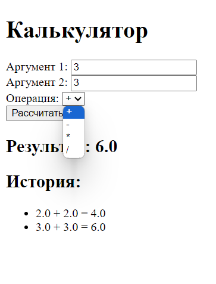

##irlix_springBoot

Проект включает в себя решения задач, разработанных для стажировки, 
и предназначен для практического обучения и развития навыков.

В данном репозитории прорабатываются темы:

+ Java core;
+ Spring MVC;
+ Spring Boot;
+ Thymeleaf.

Проект содержит реализацию калькулятора, который сохраняет историю результатов вычисления.

Описание будет пополняться по мере изучения новых тем.