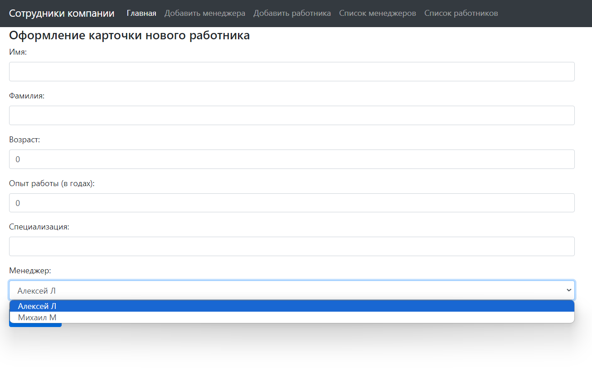
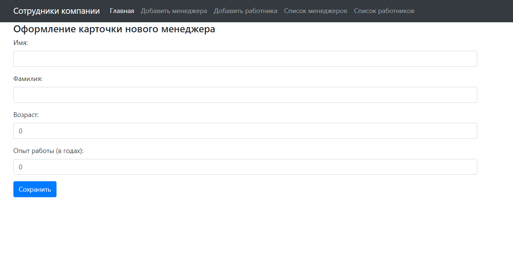
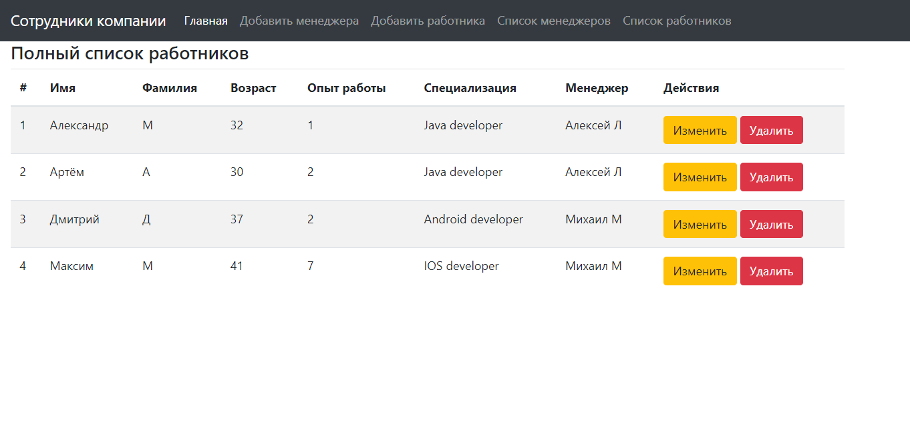
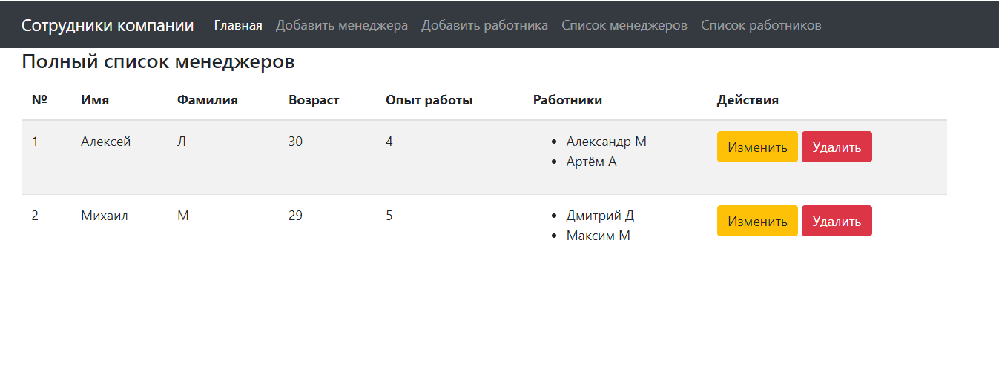

##irlix_springBoot

Проект включает в себя решения задач, разработанных для стажировки, 
и предназначен для практического обучения и развития навыков.

В данном репозитории прорабатываются темы:

+ Java core;
+ Spring MVC;
+ Spring Boot;
+ Thymeleaf.

###Проект содержит следующие проекты:

1) Калькулятор, который сохраняет историю результатов вычисления.

2) Портал для ведения журнала стрелкового оружия включает следующие возможности: добавление, редактирование, удаление и просмотр общего списка оружия.

   
   

3) Портал для ведения журналов сотрудников и менеджеров, с возможностью привязки сотрудников к менеджерам и наоборот. 
Также предусмотрена функциональность изменения и удаления данных о менеджерах и сотрудниках.

